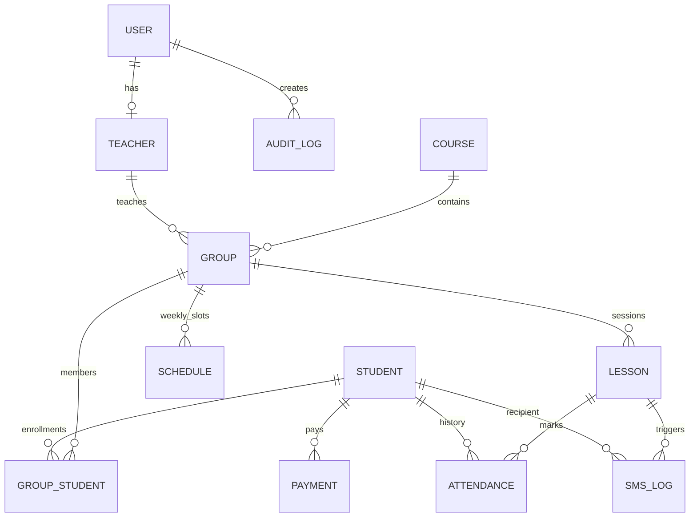

# Edu-AF ERP/CRM Architecture

## 1) ER/Data Model (Core)

## 2) Route/Page Map

### Admin Panel
- `/dashboard` – KPI cards (today lessons, absents, debtors, SMS status)
- `/students` – CRUD + CSV import
- `/teachers` – CRUD + group assignment
- `/courses` and `/groups` – course and group management
- `/schedule` – weekly slots + generated lessons
- `/payments` – add/list payments, debt overview
- `/reports/attendance` – group/student/month attendance
- `/reports/sms` – sent/failed/retrying logs
- `/settings/sms` – provider and sender setup (super admin only)

### Teacher Panel
- `/teacher/schedule` – own groups and today sessions
- `/teacher/attendance/:lessonId` – quick mark (present/absent/late/excused)
- `/teacher/messages` – manual SMS by own group

### Parent/Student Portal (optional)
- `/portal/schedule`
- `/portal/attendance`
- `/portal/payments`

## 3) API Endpoints (MVP)
- `GET/POST /api/v1/students`
- `POST /api/v1/attendance` (save + SMS trigger)
- `GET/POST /api/v1/payments`
- planned: `/api/v1/groups`, `/api/v1/lessons`, `/api/v1/reports/*`, `/api/v1/settings/*`

## 4) Attendance -> SMS workflow
1. Teacher opens lesson session and marks attendance.
2. Backend upserts attendance rows (`lesson_id + student_id` unique).
3. If status=ABSENT and SMS settings enabled, recipient is selected by `recipient_mode`.
4. Render SMS text from `ABSENT` template variables.
5. Create `sms_logs` row with `PENDING` (idempotency key: lesson+student+to_number).
6. Provider send attempt:
   - success => `SENT` + `provider_message_id`, `sent_at`
   - error => `RETRYING` or `FAILED` (max 3 attempts, exponential strategy in worker)

## 5) Queue/Retry Strategy
- Current MVP writes queue rows to `sms_logs`.
- Worker (recommended: BullMQ + Redis) should poll `PENDING/RETRYING`, execute send, and backoff delays: `30s`, `120s`, `300s`.

## 6) Security
- Session-based auth with role-based permissions.
- Audit log for settings/payment/attendance updates.
- Super-admin guard on billing/provider settings.
